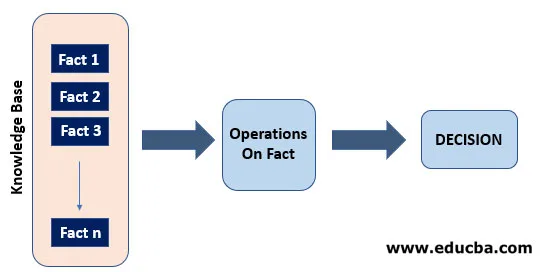
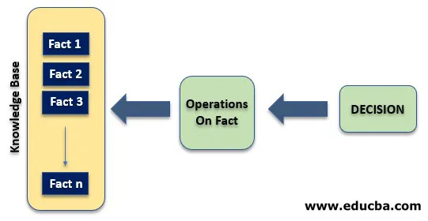

# Git and GitHub

## Git
Git is a distributed version control system that is used to track changes in source code during software development. It is intended to help programmers coordinate their efforts, but it may also be used to track changes in any set of files. Its objectives include data integrity, speed, and support for distributed, non-linear operations.

## GitHub
GitHub is a web-based Git repository hosting service that provides all of Git's distributed revision control and source code management (SCM) functionalities as well as its own. GitHub maintains Git repositories and provides developers with tools to ship better code via command-line features, issues (threaded discussions), pull requests, code review, or the use of a library of free and paid apps in the GitHub Marketplace. GitHub is changing the way software is produced through collaborative layers like the GitHub Flow, a community of 15 million developers, and an ecosystem with hundreds of connectors.

# Inferencing in Expert Systems
Inferencing refers to how expert systems implement human reasoning. It is performed by an inference engine. There are two main forms of inferencing namely: 
1. Forward chaining
2. Backward chaining

## Forward Chaining
Forward chaining is a mechanism in which multiple inferences are searched from the problem to the solution, that is, it begins with a set of rules and proceeds through a series of procedures to reach the final choice. It follows the IF…..THEN format.

### Properties of Forward chaining
- Follows the top-down approach
- Answers the question ‘what can happen next?’
- It is a data-driven approach
- It goes from facts to result

## Backward Chaining
Backward chaining is a mechanism in which multiple inferences are searched from a hypothesis back to the facts that support the hypothesis. In this case, the inference system is aware of the final decision and attempts to determine the conditions that would have resulted in that decision. It is usually used to determine the source of an issue.

## Properties of Backward chaining
- Follows the bottom-up approach
- Answers the question ‘why does this happen?’
- It is a goal-driven approach
- It goes from result to facts

